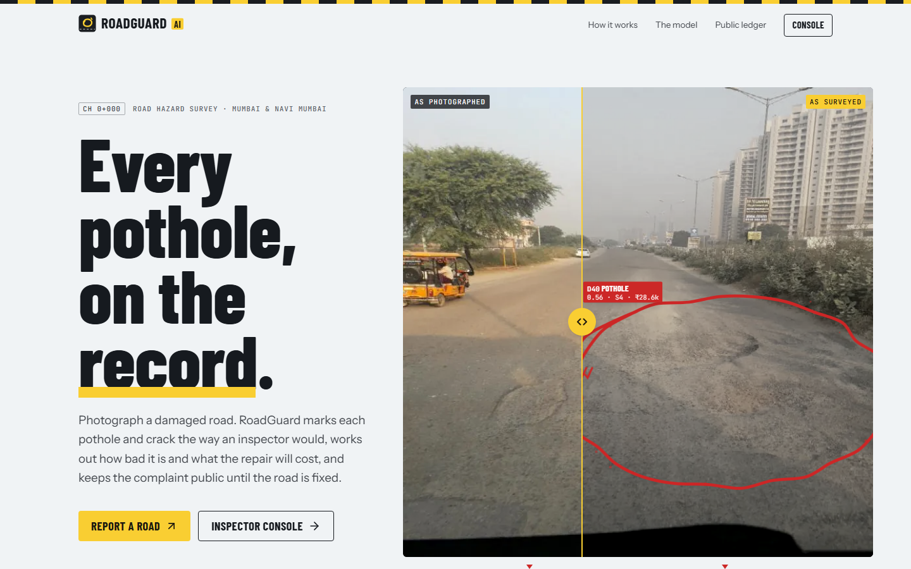
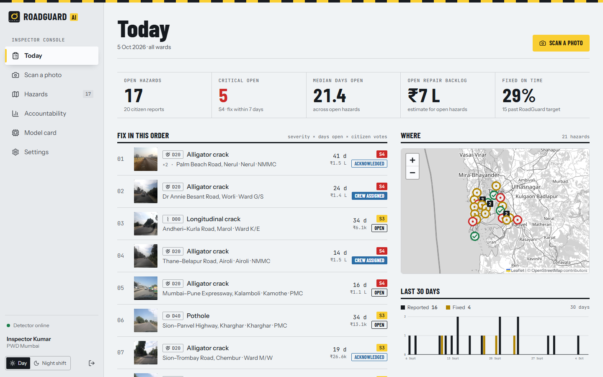
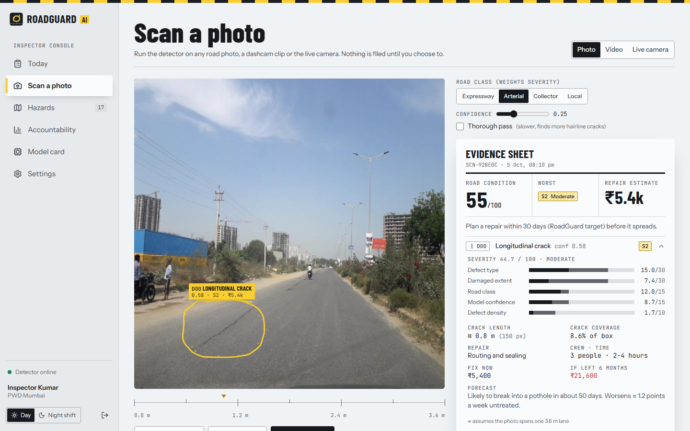
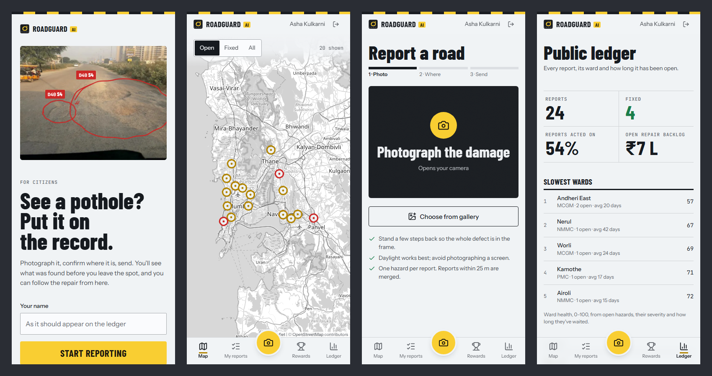
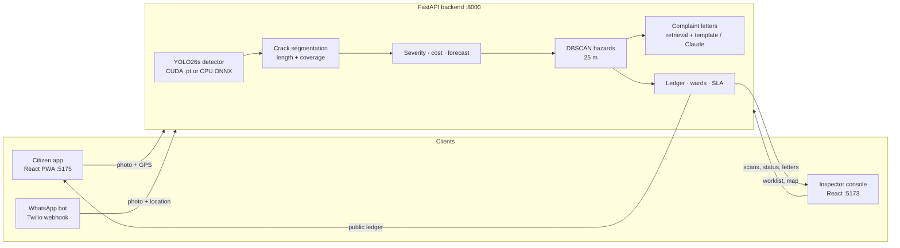

# RoadGuard AI

**Every pothole, on the record.** RoadGuard AI turns a citizen's road photo into a verified, prioritised, evidence-backed repair order that a municipal inspector can act on, and that the public can watch until the road is fixed.



<sub>Major Project · Department of Artificial Intelligence &amp; Data Science, New Horizon Institute of Technology and Management, University of Mumbai · 2026–27. Grew out of **CrackWatch**, built solo by Saud Satopay at the NIRMAN 2026 hackathon.</sub>

---

## Run it (Windows, one click)

1. Install **Node.js 20+** and **Python 3.10+** (tick "Add to PATH"). An NVIDIA GPU is used if present; otherwise everything runs on the CPU.
2. Double-click **`RoadGuard.bat`**.

The first run creates `backend\.venv`, installs PyTorch (CUDA 12.8 build when an NVIDIA GPU is found) and the npm packages, then starts three windows and opens the browser. Later runs start in seconds.

| What | Where | Sign in |
|---|---|---|
| Landing page | http://localhost:5173 | — |
| Inspector console | http://localhost:5173/console | `admin` / `admin123` |
| Citizen app | http://localhost:5175 (or `http://<your-PC-IP>:5175` on a phone on the same Wi-Fi) | any name, or `saud` / `123` |
| API docs | http://127.0.0.1:8000/docs | — |

`RoadGuard.bat stop` closes everything; `RoadGuard.bat setup` only installs. Both frontends proxy `/api` to the backend, so no certificates, CORS settings or `.env` files are needed. For the phone camera and GPS over Wi-Fi, browsers require HTTPS: create `certs/cert.pem` and `certs/key.pem` with [mkcert](https://github.com/FiloSottile/mkcert) and both apps switch to HTTPS automatically.

<details>
<summary>macOS / Linux, or running each part by hand</summary>

```bash
python -m venv --system-site-packages backend/.venv
backend/.venv/bin/pip install -r backend/requirements.txt
backend/.venv/bin/python -m uvicorn main:app --app-dir backend --port 8000
npm ci && npm run dev                       # landing + console on :5173
cd public-app && npm ci && npm run dev      # citizen app on :5175
```
</details>

---

## What it does

- **Detect.** A YOLO26s detector fine-tuned on RDD2022 finds potholes (D40) and longitudinal (D00), transverse (D10) and alligator (D20) cracks. A crack-segmentation model traces crack length and coverage where it can.
- **Decide.** Reports within 25 m are merged into one hazard (DBSCAN on GPS). Severity combines defect type, damaged extent, road class, confidence and density; each hazard gets a rupee estimate, a monsoon-aware deterioration forecast, and a place in a worklist ranked by severity × days open × citizen votes.
- **Deliver.** One click drafts a complaint letter to the responsible ward office with the photo, GPS, severity, cost and number of citizen reports, grounded in a small knowledge base of grievance routes (and polished by Claude when `ANTHROPIC_API_KEY` is set). Status moves Open → Acknowledged → Crew assigned → Fixed on a public ledger, and ward accountability is computed from that ledger.

| Inspector console: today's worklist | Scan any photo: evidence sheet |
|---|---|
|  |  |



---

## How it works



The backend stores reports in a JSON ledger (`backend/data/`), photos in `backend/uploads/`, and seeds 24 reports from RDD2022 India test photos at real Mumbai and Navi Mumbai roads on first start (`POST /admin/reset-demo` restores them). API contract: [`backend/API.md`](backend/API.md).

---

## The model

| | **RoadGuard YOLO26s** | CrackWatch YOLOv8s (replaced) |
|---|---|---|
| Training data | RDD2022: India, Japan, Czech, United States, China (motorbike) | RDD2022: Japan, India |
| mAP@0.5, held-out test (1,674 photos) | **MODEL_MAP50** | 0.635* |
| mAP@0.5:0.95 | **MODEL_MAP5095** | 0.342* |
| Czech / United States / China (photos neither model trained on) | **MODEL_FAIR** | 0.17 / 0.46 / 0.24 |
| Latency per photo (RTX 5060 Ti) | MODEL_LAT ms | 10 ms |

\* The old model was trained on RDD2022 Japan and India photos drawn from the same pool as this test split, so its Japan and India scores are likely inflated by overlap. RoadGuard never saw a test photo. Full per-class and per-country numbers are on the console's **Model card** page and in `training/results/`.

Reproduce from scratch (about 2.5 GB download and roughly 1.5 h of GPU time):

```bash
python training/download_rdd2022.py   # range-downloads only 5 country zips from the 13 GB archive
python training/prepare_rdd2022.py    # VOC -> YOLO, seeded 88/6/6 split per country
python training/train_detector.py --model yolo26s.pt --lean --epochs 25
python training/evaluate.py backend/model/best.pt:legacy training/runs/<run>/weights/best.pt:roadguard
python training/export.py --run <run> # weights + ONNX + model card + landing numbers
```

---

## Design

Kerb &amp; Asphalt: concrete-grey surfaces, asphalt ink, road-marking yellow used the way road signs use it, the black-and-yellow kerb stripe, kilometre stones for the pipeline, chainage for positions, and the inspector's spray-paint ring as the signature: real detections drawn onto real photos. Barlow Condensed (signage), Instrument Sans and JetBrains Mono, self-hosted. One token file (`shared/tokens.css`) drives both apps, with a designed Night shift theme for the console. Rationale and rules: [`DESIGN.md`](DESIGN.md).

---

## Project layout

```
RoadGuard.bat            one-click launcher (Windows)
src/                     landing page (/) and inspector console (/console)
public-app/              citizen app (PWA)
shared/                  tokens, MarkedPhoto, map, API client, formatting
backend/                 FastAPI app, routers, detector pipeline, seed, tests
training/                RDD2022 download, prep, training, evaluation, export
tools/                   showcase generator and the build-time hero poster
```

## Checks

```bash
npm run lint && npm test && npm run build                      # landing + console
cd public-app && npm run lint && npm test && npm run build     # citizen app
cd backend && .venv/Scripts/python -m pytest -q                # 56 backend tests
```

---

## Before a real deployment

This is a local demo build. The demo accounts in `backend/auth.py` are hard-coded with plaintext passwords, CORS is open so phones on the LAN can connect, the JWT secret is random per run unless `JWT_SECRET_KEY` is set, and the ledger is a JSON file. Replace those with a user database, hashed passwords, a fixed secret and a scoped origin list before exposing the API.

---

## Credits

- **Team:** Saud Satopay, Jayant Patil, Shravani Talashilkar · **Guide:** Ms. Sangita Nikumbh
- **Data:** RDD2022, Arya et al., *RDD2022: A multi-national image dataset for automatic road damage detection*, CC BY 4.0 ([figshare](https://doi.org/10.6084/m9.figshare.21431547)). Sample photos in `public/showcase/` and `backend/seed/images/` come from its India test split.
- **Models:** [Ultralytics YOLO26](https://github.com/ultralytics/ultralytics) (AGPL-3.0) fine-tuned for RoadGuard; YOLOv8s-seg crack segmentation.
- **Maps:** © OpenStreetMap contributors. **Type:** Barlow, Instrument Sans, JetBrains Mono (OFL).

RoadGuard's own code is MIT licensed. Ultralytics is AGPL-3.0; deploying the detector as a network service carries AGPL obligations.
